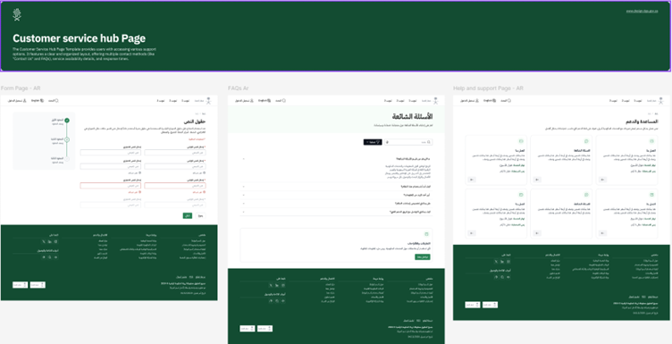

# Use Case Overview

## Develop a new DGA Help & Support Center

### 1. Purpose

This challenge aims to demonstrate the practical use of GitHub Copilot in accelerating development activities. Participants will build a new Help & Support center featuring three responsive web pages—based on Figma designs—while leveraging Copilot for code generation, structure suggestions, and localization.

### 2. Use Case Summary

Participants will develop the following frontend pages using Copilot-assisted coding:

- **Contact Us Page** – includes form fields, form validation, and submission UI
- **FAQ Page** – displays expandable/collapsible question-and-answer sections
- **Help & Support Page** – includes multiple cards

All designs are available from Figma via the link below:

[https://www.figma.com/design/l1jlg2OGS56sM970jUZ1pX/Help---Support-Template---Platforms-Code?node-id=1-23794&t=1hGcYKhWeaPU8kss-1](https://www.figma.com/design/l1jlg2OGS56sM970jUZ1pX/Help---Support-Template---Platforms-Code?node-id=1-23794&t=1hGcYKhWeaPU8kss-1)

### 3. Success Criteria

| Criteria | Description |
|----------|-------------|
| **Completion** | All three pages implemented |
| **Responsiveness** | Proper layout and usability on mobile/tablet/desktop |
| **Localization** | Full bilingual (EN/AR) support with correct directionality |
| **Copilot Utilization** | Evidence of AI-assisted coding (prompt efficiency) |
| **Design Fidelity** | Alignment with provided Figma design |

#### Getting Started:

- Tech stack is completely your choice – if in doubt, use Copilot to help brainstorm decisions on language, framework or libraries. Start with a prompt like *"Help me plan development of a new website to …"*
- Use the sample data provided in the [data folder](data/) to populate your FAQ
- The designs feature both Arabic and English, but consider starting with a single language at first before moving to bonus features below

#### Bonus Features:

*(ranked from easiest to most challenging – complete as many as you have time for)*

- Integrate the social media links on footer
- Add a search feature for the FAQ content
- Enhance the Contact Us page to either send submitted forms to a mailbox, or persist into a database (this can be local if needed)
- Add language toggle between Arabic and English, and relevant localization features to support this
- Add one or more accessibility features to the website (use the existing DGA website for ideas)
- Add some form of login/auth - you can ask Copilot to help integrate an identity provider of your choice
- Add additional tiles/pages that complement the Contact Us and FAQ pages – e.g. could you have an AI Agent that helps answer queries?

### 4. Importing Your Visual Designs

For the challenge we have provided you visual designs for each of the 3 pages, in both Arabic and English.

There are two ways to provide visual designs to your GitHub Copilot agent for this challenge:

- By manually importing and attaching image files to your repo from the [designs folder](designs/)
- Via the Figma MCP server. Use these helpful resources to guide you in setting up Copilot + MCP + Figma:
    - **Install Figma MCP from here**: [MCP Registry | Figma](https://github.com/mcp/figma/mcp-server-guide)
    - **Live Demo**: [(31) Demo: Figma design to webpage with GitHub Copilot Agent and Figma MCP server - YouTube](https://www.youtube.com/watch?v=1eZMmQ8_XkA)
    - **User Guide**: https://help.figma.com/hc/en-us/articles/32132100833559-Guide-to-the-Dev-Mode-MCP-Server

